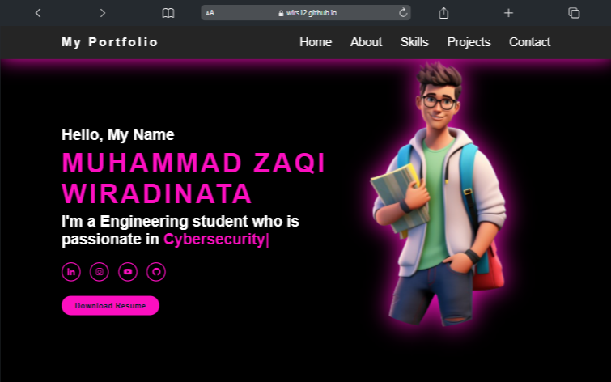

# 🌐 Personal Portfolio Website

This is a responsive and modern **Personal Portfolio Website** built using **HTML**, **CSS**, and **JavaScript**. It showcases my projects, skills, resume, and contact information, serving as a digital introduction to potential employers or clients.

---

## 🚀 Features

- ✅ Responsive layout (mobile-friendly)
- ✅ Smooth scroll and section navigation
- ✅ Animated UI components (using JavaScript)
- ✅ Project showcase with image previews
- ✅ Contact form with validation
- ✅ Downloadable resume
- ✅ Clean and modular codebase

---

## 🛠️ Built With

- **HTML5** – Semantic structure
- **CSS3** – Flexbox, Grid, Animations
- **Vanilla JavaScript** – DOM manipulation and interactivity
- (Optional: Font Awesome, Google Fonts)


## 📸 Screenshots




## 📌 How to Use

1. **Clone the repository:**
   ```bash
   git clone https://github.com/your-username/your-portfolio.git
 ```bash
cd your-portfolio


